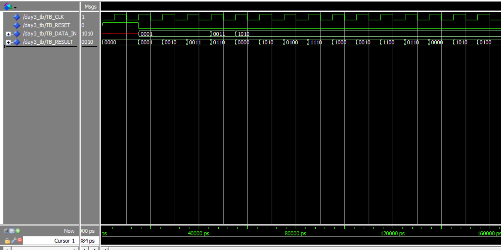

# Day 3: 4-Bit Accumulator

The goal for Day 3 was to build a core component of an Arithmetic Logic Unit (ALU): a 4-bit accumulator. This sequential component is designed to add its current input (`DATA_IN`) to the value it stored from the previous clock cycle, effectively "accumulating" a sum over time.

The design uses an internal register (`result_reg`) to hold the current sum and an active-high, asynchronous reset (`RESET`) to clear it.

## Simulation Analysis

The testbench was designed to validate three key behaviors: asynchronous reset, correct accumulation, and 4-bit overflow handling.

**1. Asynchronous Reset (0 ns - 15 ns)**

* **Event:** The simulation begins with `TB_RESET` asserted high ('1').
* **Observation:** As seen in the waveform, `TB_RESULT` is immediately forced to "0000" and held there, even as the clock (`TB_CLK`) runs.
* **Conclusion:** This confirms the active-high, asynchronous reset is working correctly, overriding all other logic.

**2. Accumulation (15 ns - 55 ns)**

* **Event:** At 15 ns, `TB_RESET` is de-asserted ('0'), and `TB_DATA_IN` is set to "0001".
* **Observation:** The `TB_RESULT` output increments by 1 on each subsequent rising clock edge (at 25 ns, 35 ns), counting up "0001", "0010", "0011". At 45 ns, the input changes to "0011" (3), and the output correctly calculates `3 + 3 = 6` (becoming "0110" at the 55 ns edge).
* **Conclusion:** This confirms the component is correctly performing the `Result <= Result + Data_In` logic and properly "remembering" its previous state between clock cycles.

**3. Overflow Handling (55 ns - 65 ns)**

* **Event:** At 55 ns, the input `TB_DATA_IN` changes to "1010" (10).
* **Observation:** At the 65 ns clock edge, the component calculates the sum of the previous result (`6`) and the new input (`10`). The mathematical result is `16`.
* **Conclusion:** Because this is a 4-bit accumulator, the value `16` (which is `10000` in binary) "overflows" the 4-bit register. The component correctly stores only the lower 4 bits, causing the `TB_RESULT` to "wrap around" and become **"0000"**. This is the expected and correct behavior for a fixed-width accumulator and demonstrates the hardware's natural handling of overflow. The accumulator then continues to add to this new "0000" value, as seen in the following cycles.
