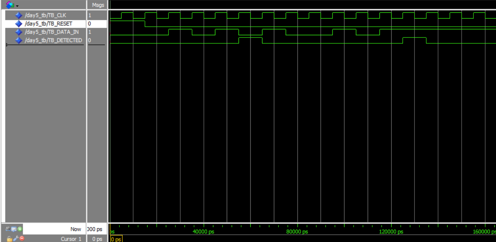

# Day 5: FSM Sequence Detector ("101")

The goal for Day 5 was to design a "brain" component: a Finite State Machine (FSM). This sequential logic component is designed to monitor a single-bit input stream (`DATA_IN`) and output a single-cycle pulse (`DETECTED_OUT`) the moment the specific sequence "101" is detected.

The design uses three states (`IDLE`, `GOT_1`, `GOT_10`) to track its progress through the sequence. The simulation waveform below verifies that this logic is implemented correctly.

## Simulation Analysis

The testbench was designed to test three critical scenarios: a successful detection, a failed detection, and a repeated detection to ensure the FSM resets itself properly.

* **Signals:**
    * `TB_RESET`: The active-high reset.
    * `TB_DATA_IN`: The 1-bit data stream being fed to the FSM.
    * `TB_DETECTED`: The 1-bit output pulse.

**1. Reset (0ns - 25ns)**
* **Event:** The simulation starts with `TB_RESET` asserted high ('1').
* **Observation:** `TB_DETECTED` is held at '0'.
* **Conclusion:** The FSM correctly initializes to the `IDLE` state.

**2. Successful Sequence "101" (25ns - 55ns)**
* **Event:** `TB_RESET` is de-asserted ('0'). The testbench sends the sequence "1", then "0", then "1" on subsequent clock cycles.
    * At 25ns, `TB_DATA_IN` = '1' (State moves `IDLE` -> `GOT_1`)
    * At 35ns, `TB_DATA_IN` = '0' (State moves `GOT_1` -> `GOT_10`)
    * At 45ns, `TB_DATA_IN` = '1' (State moves `GOT_10` -> `IDLE`)
* **Observation:** At the 45ns clock edge, exactly when the final '1' is detected, the `TB_DETECTED` output pulses **high to '1'**.
* **Conclusion:** ✅ **Test 1 Passed.** The FSM successfully detected the "101" sequence.

**3. Pulse Verification (55ns)**
* **Event:** On the very next clock edge (55ns), the input `TB_DATA_IN` changes to '0'.
* **Observation:** The `TB_DETECTED` output **returns to '0'**.
* **Conclusion:** ✅ **Test 2 Passed.** This confirms the output is a single-cycle pulse, as the FSM logic correctly resets the output on the next cycle.

**4. Failed Sequence "100" (65ns - 95ns)**
* **Event:** The testbench sends the sequence "1", then "0", then "0".
    * At 65ns, `TB_DATA_IN` = '1' (State -> `GOT_1`)
    * At 75ns, `TB_DATA_IN` = '0' (State -> `GOT_10`)
    * At 85ns, `TB_DATA_IN` = '0' (Failing input)
* **Observation:** The `TB_DETECTED` output remains at '0' throughout this entire sequence.
* **Conclusion:** ✅ **Test 3 Passed.** The FSM correctly identified the failing sequence ("100") and returned to the `IDLE` state without firing.

**5. Repeated Successful Sequence "101" (95ns - 125ns)**
* **Event:** The testbench immediately sends the "101" sequence again.
* **Observation:** At 115ns, upon receiving the final '1' of the sequence, `TB_DETECTED` **pulses high to '1'** again.
* **Conclusion:** ✅ **Test 4 Passed.** This proves the FSM correctly reset itself after the failed sequence and was ready to find the correct sequence again.

### Final Summary
The simulation fully verifies the FSM's logic. It correctly identifies valid sequences, rejects invalid ones, and produces a clean, single-cycle pulse upon detection.
