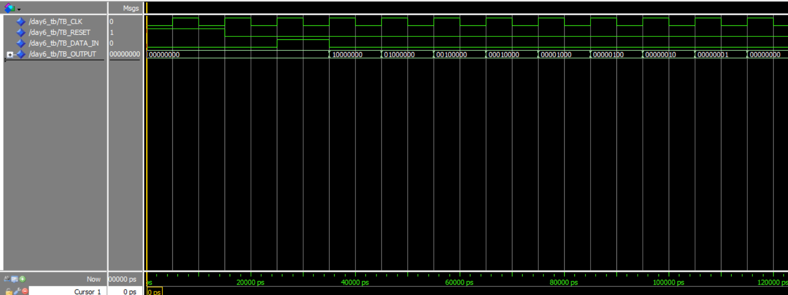

# Day 6: 8-Bit Shift Register (SIPO)

The objective for Day 6 was to design and verify a fundamental component for data movement: an 8-bit Serial-In, Parallel-Out (SIPO) Shift Register. This sequential component takes a single bit of data at a time (`DATA_IN`) and shifts it one position down the register on every clock cycle. The `Parallel_Out` port allows us to see all 8 bits stored inside the register at once.

The simulation waveform below perfectly demonstrates this "traveling" data.

## Simulation Analysis

The testbench was designed to test three key functions: the active-high reset, the injection of a single data bit, and the progressive shift of that bit through all 8 positions.

* **Signals:**
    * `TB_RESET`: The active-high reset.
    * `TB_DATA_IN`: The 1-bit serial data being fed into the register.
    * `TB_OUTPUT`: The 8-bit parallel output showing the register's full contents.

**1. Reset (0ns - 15ns)**
* **Event:** The simulation begins with `TB_RESET` asserted high ('1').
* **Observation:** `TB_OUTPUT` is held at "00000000".
* **Conclusion:** ✅ The reset correctly clears all 8 bits of the register.

**2. Injecting a Single '1' (15ns - 35ns)**
* **Event:** `TB_RESET` is de-asserted ('0'). After one cycle of shifting in a '0' (at 25ns), the `TB_DATA_IN` is asserted to '1' for a single clock cycle.
* **Observation:** At the 35ns rising edge, the `TB_OUTPUT` changes from "00000000" to **"10000000"**.
* **Conclusion:** ✅ The '1' was successfully injected into the most significant bit (bit 7) of the register.

**3. The "Shift" (35ns - 105ns)**
* **Event:** `TB_DATA_IN` is immediately set back to '0'. We then let the clock run for 7 more cycles.
* **Observation:** As seen in the waveform, the single '1' bit "travels" one position to the right on each subsequent rising edge:
    * At 45ns: `TB_OUTPUT` = **"01000000"** (Bit 6)
    * At 55ns: `TB_OUTPUT` = **"00100000"** (Bit 5)
    * At 65ns: `TB_OUTPUT` = **"00010000"** (Bit 4)
    * At 75ns: `TB_OUTPUT` = **"00001000"** (Bit 3)
    * At 85ns: `TB_OUTPUT` = **"00000100"** (Bit 2)
    * At 95ns: `TB_OUTPUT` = **"00000010"** (Bit 1)
    * At 105ns: `TB_OUTPUT` = **"00000001"** (Bit 0)
* **Conclusion:** ✅ The shift logic (`Data_In & reg(7 downto 1)`) is working perfectly.

**4. Ejection (115ns)**
* **Event:** At the 115ns rising edge, another '0' is shifted in.
* **Observation:** The '1' that was in bit 0 is "pushed out" of the register. The `TB_OUTPUT` returns to **"00000000"**.
* **Conclusion:** ✅ The register correctly handles the full data path from serial-in to serial-out.

### Final Summary
The simulation confirms the shift register is fully functional. It correctly resets, loads serial data, shifts the data one position per clock cycle, and makes the internal state visible on the parallel output.
